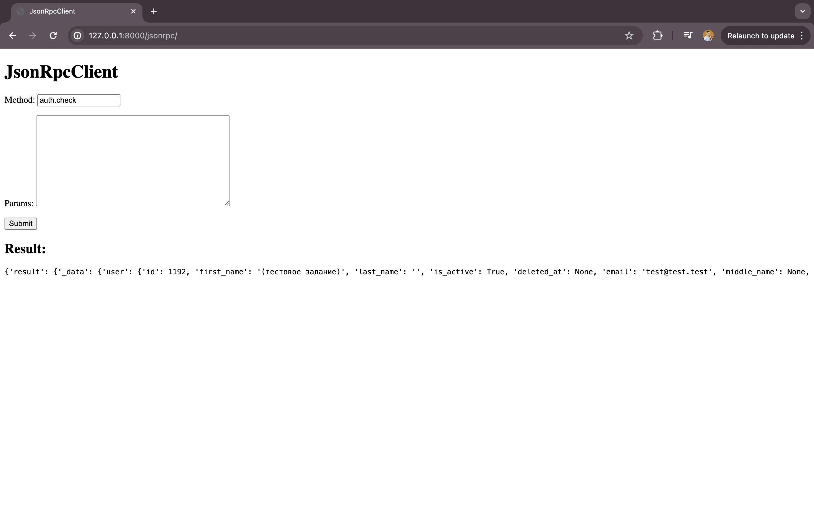

# JSON-RPC client

JSON-RPC client based on django.

## Authors

- [@temirlanmukatayev](https://www.github.com/temirlanmukatayev)

## Features

- Sending rpc requests to existing jsonrpc-service through html-form.
- Show request result as answer below the form.

## Used By

This project is used by the following companies:

- QualixDev

## Result of successful request

